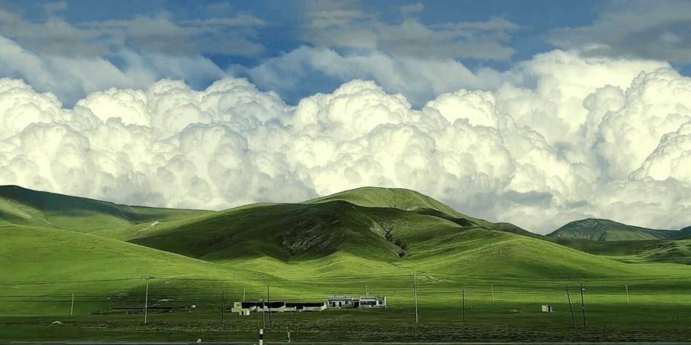

## About

- 🎓 Information Systems student based in Batam, Indonesia 
- 🎨 More into design, but currently diving into tech and AI 
- 🤖 Currently learning Artificial Intelligence and exploring its real-world applications 
- 💻 Passionate about technology, especially how it can solve problems (just like math!)

Still learning, still growing 🌱

---

## Skills & Tech Stack

💻 Programming Languages 
- Python (basic)

🛠️ Tools & Technologies 
- Visual Studio Code 
- Git & GitHub 

🎨 Design 
- Canva 
- Figma 

🤖 Currently Learning 
- Artificial Intelligence 

---

## GitHub Stats

---

## Connect with Me

- 📸 Instagram: [@jocelynnn___](https://www.instagram.com/jocelynnn___/)  
- ✉️ Email: mailto:jocelynkuliah@gmail.com

## Connect with Me

  
  

## Quotes

maybe the chapter that you're so afraid of is actually going to be your favorite ♡

---

